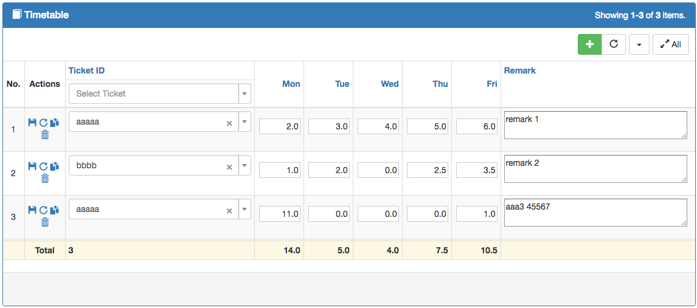
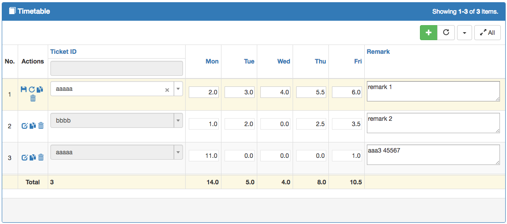

Inline Gridview
===============
Yii2 Inline Gridview for editing content like in Excel  

  

  

The controls are extended from popular control [yii2-grid](https://github.com/kartik-v/yii2-grid)  

Installation
------------

The preferred way to install this extension is through [composer](http://getcomposer.org/download/).

Either run

```
php composer.phar require --prefer-dist dacduong/yii2-inlinegrid "*"
```

or add

```
"dacduong/yii2-inlinegrid": "*"
```

to the require section of your `composer.json` file.


Usage
-----

Sample code from yii2-teamhelper module  

View:
```
$textInputControlOptions = [
    'class' => 'text-right',
    'maxlength' => 4,
    'size' => 8,
    'defaultValue' => 0,
];
$gridColumns = [
    [
        'class' => SerialColumn::className(),
        'header' => 'No.',
    ],    
    [
        'class' => ActionColumn::className(),
        'width' => '100px',
        'alwaysEdit' => true,
        'actionSaveRow' => Url::to('./save-row'),
        'actionReloadRow' => Url::to('./reload-row'),
        'actionDeleteRow' => Url::to('./delete-row'),
        'pageSummary' => 'Total',
    ],
    [
        'class' => HiddenInputColumn::className(),
        'attribute' => 'id',
        'hidden' => true,
    ],
    [
        'class' => Select2Column::className(),
        'attribute' => 'ticket_id',
        'modelFnc' => 'getAvailableTicket',
        'controlOptions' => [
            'options' => [
                'id' => Yii::$app->security->generateRandomString(10),
                'placeholder' => 'Select Ticket',
                'multiple' => false,
            ],
            'pluginOptions' => [
                'ajax' => [
                    'url' => Url::to(['/teamhelper/search/team-object']),
                    'data' => new JsExpression('function(params) { return {q:params.term, type:"ticket"}; }'),                    
                ],
                'minimumInputLength' => 2,
                'allowClear' => true,
                'width' => '300px',
            ],
        ],
        'pageSummary' => true,
        'pageSummaryFunc' => GridView::F_COUNT,
        'filter' => Select2::widget([
            'model' => $searchModel,
            'attribute' => 'ticket_id',
            'data' => $searchModel->getAvailableTicket(),
            'options' => [
                'id' => Yii::$app->security->generateRandomString(10),
                'placeholder' => 'Select Ticket',
                'multiple' => false,
            ],
            'pluginOptions' => [
                'ajax' => [
                    'url' => Url::to(['/teamhelper/search/team-object']),
                    'data' => new JsExpression('function(params) { return {q:params.term, type:"ticket"}; }'),                    
                ],
                'minimumInputLength' => 2,
                'allowClear' => true,
            ],
        ]),
    ],
    [
        'class' => TextInputColumn::className(),
        'attribute' => 'day0',
        'format' => ['decimal', 1],
        'pageSummary' => true,
        'controlOptions' => $textInputControlOptions,
        'filter' => false,
        'mergeHeader' => true,
        'hAlign' => GridView::ALIGN_RIGHT,
    ],
    [
        'class' => TextInputColumn::className(),
        'attribute' => 'day1',
        'format' => ['decimal', 1],
        'pageSummary' => true,
        'controlOptions' => $textInputControlOptions,
        'filter' => false,
        'mergeHeader' => true,
        'hAlign' => GridView::ALIGN_RIGHT,
    ],
    [
        'class' => TextInputColumn::className(),
        'attribute' => 'day2',
        'format' => ['decimal', 1],
        'pageSummary' => true,
        'controlOptions' => $textInputControlOptions,
        'filter' => false,
        'mergeHeader' => true,
        'hAlign' => GridView::ALIGN_RIGHT,
    ],
    [
        'class' => TextInputColumn::className(),
        'attribute' => 'day3',
        'format' => ['decimal', 1],
        'pageSummary' => true,
        'controlOptions' => $textInputControlOptions,
        'filter' => false,
        'mergeHeader' => true,
        'hAlign' => GridView::ALIGN_RIGHT,
    ],
    [
        'class' => TextInputColumn::className(),
        'attribute' => 'day4',
        'format' => ['decimal', 1],
        'pageSummary' => true,
        'controlOptions' => $textInputControlOptions,
        'filter' => false,
        'mergeHeader' => true,
        'hAlign' => GridView::ALIGN_RIGHT,
    ],
    [
        'class' => TextareaColumn::className(),
        'attribute' => 'remark',
        'vAlign' => 'top',
        'controlOptions' => [
            'maxlength' => 255,
            'rows' => 2,
            'cols' => 40
        ],
        'filter' => false,
        'mergeHeader' => true
    ],
];
```

Controller:
```
    public function actionSaveRow($week = '') {        
        Yii::$app->response->format = Response::FORMAT_JSON;
        $req = Yii::$app->request;
        if ($req->isAjax) {
            $formName = 'Timetable';
            $className = Timetable::className();
            
            $req = $req->post($formName);
            $rowData = array_values($req)[0];
            $id = $rowData['id'];

            $model = $id > 0 ? $className::findOne($id) : null;
            if ($model == null) {//for insert
                $model = new $className();
            }
            //formName in load function must set to empty
            if ($model->load($rowData, '') && $model->save()) {
            }
            return ['result' => $model, 'errors' => $model->errors];
        }
        return [];
    }
    
    public function actionReloadRow() {
        Yii::$app->response->format = Response::FORMAT_JSON;
        $req = Yii::$app->request;     
        if ($req->isAjax) {
            $className = Timetable::className();
            
            $id = $req->post('id');
            
            $model = $id > 0 ? $className::findOne($id) : null;
            if ($model == null) {//for insert
                Yii::error("actionReloadRow fail: no record found for id $id");
                return [];
            }
            return ['result' => $model];
        }
        return [];
    }
    
    public function actionDeleteRow()
    {
        Yii::$app->response->format = Response::FORMAT_JSON;
        $req = Yii::$app->request;     
        if ($req->isAjax) {
            
            $id = $req->post('id');
            
            $result = $this->findModel($id)->delete();
            
            if ($result === false) {
                Yii::error("actionDeleteRow fail: $id");
                return ['errors' => true];
            }
            return ['errors' => false];
        }
        return [];
    }
```